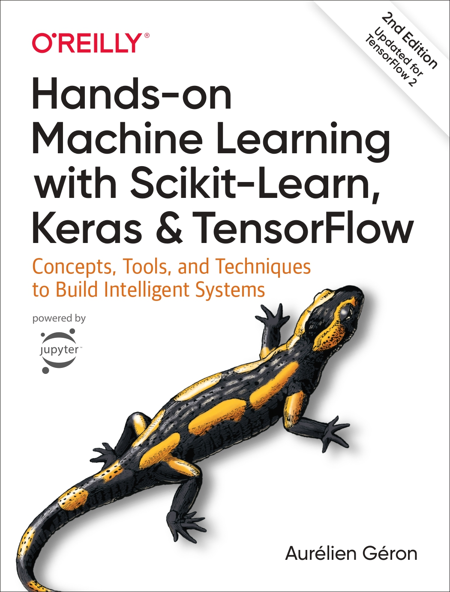

{
  "nbformat": 4,
  "nbformat_minor": 0,
  "metadata": {
    "colab": {
      "provenance": []
    },
    "kernelspec": {
      "name": "python3",
      "display_name": "Python 3"
    },
    "language_info": {
      "name": "python"
    }
  },
  "cells": [
    {
      "cell_type": "markdown",
      "source": [
        "**AUTHOR: RAIHAN SALMAN BAEHAQI (1103220180)**"
      ],
      "metadata": {
        "id": "DkwBpTwCWZIX"
      }
    },
    {
      "cell_type": "markdown",
      "source": [
        ""
      ],
      "metadata": {
        "id": "R_h22csiWeyc"
      }
    },
    {
      "cell_type": "markdown",
      "source": [
        "**Hands-on Machine Learning with Scikit-Learn, Keras, and TensorFlow**"
      ],
      "metadata": {
        "id": "JpjF82yNUULz"
      }
    },
    {
      "cell_type": "markdown",
      "source": [
        "**Repository Overview**"
      ],
      "metadata": {
        "id": "k49YOddkUWcr"
      }
    },
    {
      "cell_type": "markdown",
      "source": [
        "This repository contains the code and theoretical explanations reproduced from \"Hands-on Machine Learning with Scikit-Learn, Keras, and TensorFlow\" (2nd Edition) by Aurélien Géron. The repository serves as a hands-on learning resource for machine learning and deep learning concepts using Python libraries such as Scikit-Learn, Keras, and TensorFlow."
      ],
      "metadata": {
        "id": "IkFT4d9WUZeU"
      }
    },
    {
      "cell_type": "markdown",
      "source": [
        "**Chapter Summary**"
      ],
      "metadata": {
        "id": "CIDyos4GUctU"
      }
    },
    {
      "cell_type": "markdown",
      "source": [
        "**Part I: The Fundamentals of Machine Learning**"
      ],
      "metadata": {
        "id": "e-KZWc9nUgMW"
      }
    },
    {
      "cell_type": "markdown",
      "source": [
        "**Chapter 1: The Machine Learning Landscape**\n",
        "\n",
        "This chapter introduces machine learning, its types (supervised, unsupervised, reinforcement learning), and the challenges it faces. Key concepts like instance-based versus model-based learning, overfitting, and underfitting are explained."
      ],
      "metadata": {
        "id": "Y9JViA1RUjTN"
      }
    },
    {
      "cell_type": "markdown",
      "source": [
        "**Chapter 2: End-to-End Machine Learning Project**\n",
        "\n",
        "This chapter walks through an entire machine learning project. The steps include framing the problem, obtaining and preparing the data, selecting and training models, fine-tuning, and launching a model in production."
      ],
      "metadata": {
        "id": "L9aX_x1NUpsK"
      }
    },
    {
      "cell_type": "markdown",
      "source": [
        "**Chapter 3: Classification**\n",
        "\n",
        "This chapter covers classification problems and introduces algorithms like Logistic Regression, SVM, and k-Nearest Neighbors. It also explores performance measures such as precision, recall, and the confusion matrix."
      ],
      "metadata": {
        "id": "FMtDNlg-Uviw"
      }
    },
    {
      "cell_type": "markdown",
      "source": [
        "**Chapter 4: Training Models**\n",
        "\n",
        "The chapter discusses training models using Linear Regression, Polynomial Regression, and Gradient Descent. It emphasizes the importance of hyperparameter tuning and introduces regularization techniques like Ridge and Lasso."
      ],
      "metadata": {
        "id": "C_vxNPIyUz_u"
      }
    },
    {
      "cell_type": "markdown",
      "source": [
        "**Chapter 5: Support Vector Machines**\n",
        "\n",
        "SVMs are introduced as powerful classifiers capable of performing linear or non-linear classification. The chapter discusses both hard and soft margin classifiers, and how to use the kernel trick to handle non-linear data.\n"
      ],
      "metadata": {
        "id": "-PdIH0-mU40z"
      }
    },
    {
      "cell_type": "markdown",
      "source": [
        "**Chapter 6: Decision Trees**\n",
        "\n",
        "This chapter explains how Decision Trees work for both classification and regression tasks. It also covers the CART algorithm, Gini impurity, entropy, and regularization of decision trees using hyperparameters like max_depth and min_samples_split.\n"
      ],
      "metadata": {
        "id": "SPz462cAU69P"
      }
    },
    {
      "cell_type": "markdown",
      "source": [
        "**Part II: Neural Networks and Deep Learning**"
      ],
      "metadata": {
        "id": "HAF4OATRU8n9"
      }
    },
    {
      "cell_type": "markdown",
      "source": [
        "**Chapter 7: Ensemble Learning and Random Forests**\n",
        "\n",
        "This chapter dives into ensemble learning methods like bagging, boosting, and stacking, with a special focus on Random Forests and Extra Trees. It explains how combining multiple models can lead to better performance.\n"
      ],
      "metadata": {
        "id": "KtFl4yDCU-vG"
      }
    },
    {
      "cell_type": "markdown",
      "source": [
        "**Chapter 8: Dimensionality Reduction**\n",
        "\n",
        "Dimensionality reduction techniques such as PCA and Kernel PCA are covered in this chapter, helping to simplify datasets while preserving their variance. It also discusses Manifold Learning methods like LLE for handling complex datasets.\n"
      ],
      "metadata": {
        "id": "f_cXnVgNVBH-"
      }
    },
    {
      "cell_type": "markdown",
      "source": [
        "**Chapter 9: Unsupervised Learning Techniques**\n",
        "\n",
        "The chapter discusses unsupervised learning algorithms like clustering (e.g., K-Means, DBSCAN) and anomaly detection. It shows how to apply these techniques to real-world datasets.\n"
      ],
      "metadata": {
        "id": "LMUZLyl2VC4G"
      }
    },
    {
      "cell_type": "markdown",
      "source": [
        "**Chapter 10: Introduction to Artificial Neural Networks with Keras**\n",
        "\n",
        "Here, neural networks are introduced. It shows how to build and train simple neural networks using Keras, starting with the Perceptron and moving on to multi-layer networks with backpropagation.\n"
      ],
      "metadata": {
        "id": "l3eh8fgTVEel"
      }
    },
    {
      "cell_type": "markdown",
      "source": [
        "**Chapter 11: Training Deep Neural Networks**\n",
        "\n",
        "This chapter explores challenges such as vanishing gradients, and techniques like Batch Normalization and Dropout to train deep neural networks effectively. It also introduces advanced optimization methods like Adam.\n"
      ],
      "metadata": {
        "id": "vJSAqZpGVIEp"
      }
    },
    {
      "cell_type": "markdown",
      "source": [
        "**Chapter 12: Custom Models and Training with TensorFlow**\n",
        "\n",
        "This chapter shows how to customize models using TensorFlow, including creating custom layers, loss functions, and training loops. It also covers saving and restoring models.\n"
      ],
      "metadata": {
        "id": "UbcndonbVJ0L"
      }
    },
    {
      "cell_type": "markdown",
      "source": [
        "**Chapter 13: Loading and Preprocessing Data with TensorFlow**\n",
        "\n",
        "Here, TensorFlow’s Data API is introduced for handling large datasets. It demonstrates how to load, shuffle, and preprocess data efficiently for deep learning tasks.\n"
      ],
      "metadata": {
        "id": "UafMaaOnVLhT"
      }
    },
    {
      "cell_type": "markdown",
      "source": [
        "**Chapter 14: Deep Computer Vision Using Convolutional Neural Networks**\n",
        "\n",
        "Convolutional Neural Networks (CNNs) are the focus of this chapter, detailing architectures like LeNet, VGG, and ResNet for image classification, segmentation, and more.\n"
      ],
      "metadata": {
        "id": "xKLtKlI0VNhm"
      }
    },
    {
      "cell_type": "markdown",
      "source": [
        "**Chapter 15: Processing Sequences Using RNNs and CNNs**\n",
        "\n",
        "The chapter covers Recurrent Neural Networks (RNNs) for sequence data, including time series forecasting and natural language processing (NLP) tasks. It also briefly introduces CNNs for sequence processing.\n"
      ],
      "metadata": {
        "id": "D30BupoIVPYE"
      }
    },
    {
      "cell_type": "markdown",
      "source": [
        "**Chapter 16: Natural Language Processing with RNNs and Attention**\n",
        "\n",
        "This chapter delves into NLP techniques, including generating text with RNNs, machine translation with encoder-decoder networks, and attention mechanisms.\n"
      ],
      "metadata": {
        "id": "f2ex0JMuVRNn"
      }
    },
    {
      "cell_type": "markdown",
      "source": [
        "**Chapter 17: Representation Learning and Generative Learning Using Autoencoders and GANs**\n",
        "\n",
        "The chapter explores unsupervised learning with Autoencoders and Generative Adversarial Networks (GANs), discussing how to learn compact representations and generate new data.\n"
      ],
      "metadata": {
        "id": "d90oRf5-VS1Q"
      }
    },
    {
      "cell_type": "markdown",
      "source": [
        "**Chapter 18: Reinforcement Learning**\n",
        "\n",
        "Reinforcement Learning (RL) is introduced, focusing on Q-Learning and Deep Q-Networks (DQNs). It also discusses training agents to perform tasks through trial and error.\n"
      ],
      "metadata": {
        "id": "a1dj9LzKVVQi"
      }
    },
    {
      "cell_type": "markdown",
      "source": [
        "**Chapter 19: Training and Deploying TensorFlow Models at Scale**\n",
        "\n",
        "This chapter explains how to deploy models using TensorFlow Serving and Google Cloud AI Platform, and scale them across multiple machines."
      ],
      "metadata": {
        "id": "hTxiyPF9VXUc"
      }
    },
    {
      "cell_type": "markdown",
      "source": [
        "**Conclusion**\n"
      ],
      "metadata": {
        "id": "zcwle2hwVZOd"
      }
    },
    {
      "cell_type": "markdown",
      "source": [
        "This repository will guide you through a comprehensive hands-on learning journey of Machine Learning and Deep Learning. You will gain practical experience using Scikit-Learn, Keras, and TensorFlow to solve real-world problems."
      ],
      "metadata": {
        "id": "OpknnFtFVcRR"
      }
    }
  ]
}